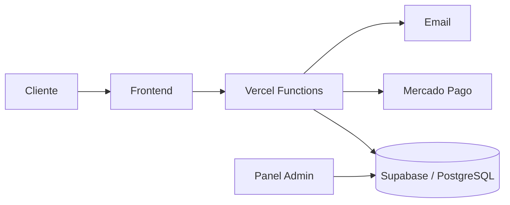

# FER⚡ELECTRO

<p align="center">
  
</p>

<p align="center">
  E-commerce full stack para FER ELECTRO, con catálogo dinámico, pagos, stock, seguimiento de pedidos y panel administrativo.
</p>

<p align="center">
  <a href="https://fer-electro.vercel.app/"><strong>Ver demo</strong></a>
</p>

## Sobre el proyecto

FER ELECTRO es una tienda online desarrollada para cubrir el flujo completo de compra de un comercio: catálogo, carrito, checkout, pago, confirmación, stock, seguimiento y administración.

El frontend está construido con HTML, CSS y JavaScript. El backend utiliza funciones serverless en Vercel y Supabase/PostgreSQL como capa de datos, autenticación y seguridad.

## Funcionalidades principales

- Catálogo dinámico desde Supabase.
- Carrito y checkout responsive.
- Mercado Pago Checkout Pro.
- Webhook de verificación de pagos.
- Validación server-side de precio y stock.
- Descuento atómico de stock.
- Estado especial `pagado_revisar_stock` para conflictos de disponibilidad.
- Seguimiento privado de pedidos mediante token.
- Panel Admin para productos, stock, imágenes y pedidos.
- Filtros, alertas de stock y exportación CSV.
- Confirmación automática por email.
- Protección anti-spam / rate limiting.
- SEO básico, sitemap, robots, PWA y página 404.
- Imágenes locales optimizadas en WebP.

## Stack

| Capa | Tecnología |
|---|---|
| Frontend | HTML5, CSS3, JavaScript |
| Backend | Node.js + Vercel Serverless Functions |
| Base de datos | Supabase + PostgreSQL |
| Autenticación | Supabase Auth |
| Seguridad | RLS, validación server-side, rate limiting |
| Pagos | Mercado Pago |
| Email | Nodemailer / Gmail SMTP |
| Deploy | Vercel |
| Versionado | Git + GitHub |

## Arquitectura



## Flujo de una compra

1. El cliente agrega productos al carrito.
2. Completa sus datos en el checkout.
3. `/api/checkout` vuelve a consultar precio y stock en Supabase.
4. Se crea el pedido en estado pendiente.
5. Mercado Pago procesa el pago.
6. El webhook consulta el pago directamente a Mercado Pago.
7. Si el pago es válido, Supabase confirma el pedido y descuenta stock de forma transaccional.
8. El cliente recibe el enlace privado de seguimiento.
9. El administrador gestiona preparación, envío y entrega desde el panel.

## Seguridad

- Las claves privadas permanecen solo en Vercel.
- El navegador no recibe `SUPABASE_SERVICE_ROLE_KEY` ni `MERCADOPAGO_ACCESS_TOKEN`.
- RLS protege productos, administradores, pedidos e ítems.
- El backend no confía en precios enviados desde el cliente.
- Los pagos se verifican servidor-a-servidor.
- Los datos del cliente no se exponen en endpoints públicos.
- La exportación CSV neutraliza valores que podrían interpretarse como fórmulas.
- El panel utiliza autenticación y permisos mediante `admin_users`.

Más detalle en [docs/README-PRODUCCION.md](./docs/README-PRODUCCION.md) y [docs/SECURITY-HARDENING.md](./docs/SECURITY-HARDENING.md).

## Estructura

```text
.
├── api/                 # Backend serverless
├── assets/
│   ├── css/             # Storefront y Admin
│   ├── images/          # Marca, fondos y productos
│   └── js/              # Lógica de tienda y administración
├── database/            # SQL de Supabase
├── docs/                # Producción, seguridad y checklist
├── lib/                 # Seguridad y email
├── admin.html
├── index.html
├── pedido.html
└── politicas.html
```

## Variables de entorno

El archivo [.env.example](./.env.example) documenta las variables requeridas sin incluir secretos reales.

Variables principales:

- `SUPABASE_URL`
- `SUPABASE_PUBLISHABLE_KEY`
- `SUPABASE_SERVICE_ROLE_KEY`
- `MERCADOPAGO_ACCESS_TOKEN`
- `MERCADOPAGO_WEBHOOK_SECRET`
- `PUBLIC_SITE_URL`
- `GMAIL_USER`
- `GMAIL_APP_PASSWORD`
- `EMAIL_REPLY_TO`
- `RATE_LIMIT_SECRET`

## Estado

La parte técnica está avanzada y el checklist de lanzamiento ya tiene resueltos catálogo, checkout, Mercado Pago en TEST, webhook, stock, seguimiento, Admin, responsive, SEO y email.

Antes de producción definitiva quedan las tareas comerciales y de validación final documentadas en [docs/CHECKLIST-LANZAMIENTO.md](./docs/CHECKLIST-LANZAMIENTO.md), especialmente credenciales productivas de Mercado Pago y una compra real controlada.

## Desarrollo local

Clonar el repositorio y abrir `index.html` con Live Server en VS Code.

```bash
git clone https://github.com/angeljoaquinbogado/fer-electro.git
cd fer-electro
```

## Autor

**Ángel Joaquín Bogado**

Proyecto personal de desarrollo web y e-commerce.
